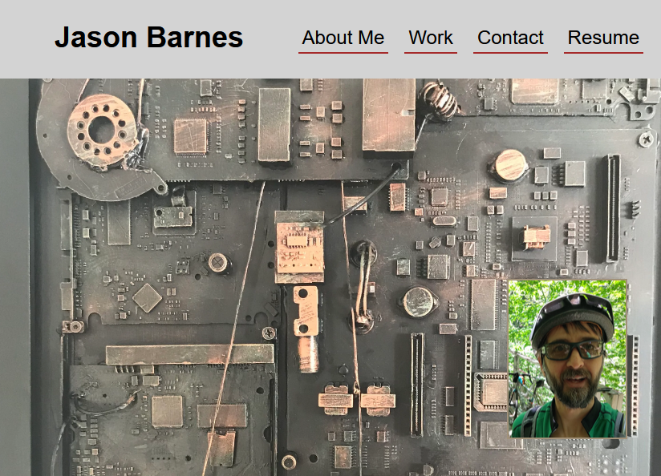

# Jason Barnes Portfolio

## Description 
Herein lies a portfolio of my past and current projects. This particular website displays my skills in HTML and advanced CSS using layout techniques such as FLEX and GRID. It also demonstrates the use of advanced hover techniques and animations. 

This website is also responsive and adapts to multiple screen sizes and devices. It aims to provide easy navigation and readability for all devices including desktop and laptop computers, tablets, and mobile phones. 

The website can be viewed at [https://yooperjb.github.io/portfolio/](https://yooperjb.github.io/portfolio/).

---

## Usage

Anyone is welcome to use the template for themselves. Usage is easy, simply download directory, modify to your liking, and upload to the root of your web server.

